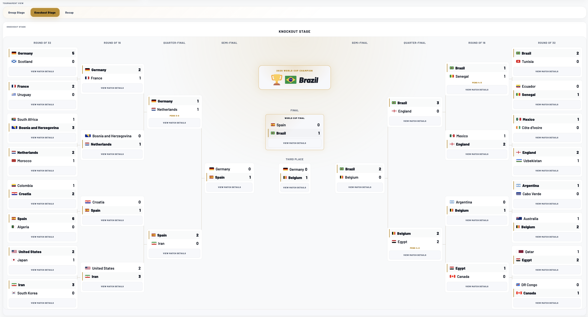

# World Cup 2026 Predictor

World Cup 2026 Predictor is a polished full-stack tournament simulator and match prediction platform built for the expanded 48-team FIFA World Cup format. It combines score-based match predictions, live tournament state, knockout progression, Monte Carlo simulation, and recap analytics in a production-ready web experience that is fully deployed online.

## Live Demo

**https://world-cup-2026-predictor-ashy.vercel.app/**

Sample Tournament Simulation:


## Features

- 48-team World Cup simulation covering groups, third-place qualification, and the full knockout bracket
- Score-based match prediction powered by backend probability and simulation logic
- Live group tables with automatic standings updates as results change
- Knockout bracket simulation for Round of 32 through the Final
- Monte Carlo tournament simulation for large-batch outcome analysis
- Realistic penalty shootouts using kick-by-kick stopping logic and sudden death
- Upset classification system for knockout results and recap storytelling
- Predictor Mode for manual picks and Simulator Mode for automated runs
- Recap and dashboard analytics including champion paths, probabilities, and tournament awards
- Dark and light mode support for the full interface

## Tech Stack

- Frontend: React 19, Vite 7, plain CSS
- Backend: FastAPI, Uvicorn
- Data: repo-local JSON tournament datasets in `data/`
- State: browser local storage and shareable URL hash support for predictor mode
- Deployment: Vercel frontend + Render backend

## Production Deployment

The app is fully deployed in production:

- Frontend hosted on Vercel
- Backend hosted on Render

Recent production-readiness improvements include:

- realistic penalty shootout logic
- improved upset classification logic
- production deployment support
- stable frontend/backend integration via environment-based API configuration

## Project Structure

```text
backend/
  app/
    main.py
    models/
    routes/
    services/
    utils/
  .env.example
  requirements.txt
frontend/
  public/
  src/
  .env.example
  package.json
  vite.config.js
  vercel.json
data/
  fixtures.json
  groups.json
  ratings.json
  teams.json
README.md
run.sh
setup.sh
```

## Runtime Overview

- The frontend calls the backend for `/teams`, `/groups`, `/fixtures`, `/predict-match`, `/simulate-one`, and `/simulate-tournament`.
- Manual prediction state is browser-side and can be restored from the URL hash and local storage.
- The backend loads tournament data from the repo-level `data/` directory.
- Static frontend assets live in `frontend/public/`.

## Environment Variables

### Frontend

Copy the example file for local use:

```bash
cp frontend/.env.example frontend/.env
```

Available variable:

```text
VITE_API_BASE_URL=http://127.0.0.1:8000
```

Notes:

- Local development falls back to `http://127.0.0.1:8000` if `VITE_API_BASE_URL` is unset.
- Production builds do not fall back to localhost. Set `VITE_API_BASE_URL` to your deployed backend URL.

### Backend

Copy the example file for local use:

```bash
cp backend/.env.example backend/.env
```

Available variables:

```text
APP_ENV=development
ENABLE_API_DOCS=true
ALLOWED_ORIGINS=http://localhost:5173,http://127.0.0.1:5173
RATE_LIMIT_WINDOW_SECONDS=60
RATE_LIMIT_PREDICT_MATCH=120
RATE_LIMIT_SIMULATE_ONE=30
RATE_LIMIT_SIMULATE_BATCH=12
PUBLIC_SIMULATION_MAX=2000
```

Notes:

- `ALLOWED_ORIGINS` is a comma-separated allowlist for CORS.
- In production, set `APP_ENV=production` and define `ALLOWED_ORIGINS` explicitly.
- The backend reads `backend/.env` first, then a repo-root `.env` if present. Real environment variables override both.

## Local Development

Quick start:

```bash
chmod +x setup.sh run.sh
./setup.sh
./run.sh
```

Manual start:

```bash
cd backend
python3 -m venv .venv
./.venv/bin/pip install -r requirements.txt
./.venv/bin/uvicorn app.main:app --reload --host 127.0.0.1 --port 8000
```

```bash
cd frontend
npm install
npm run dev
```

Local URLs:

- Frontend: `http://127.0.0.1:5173`
- Backend: `http://127.0.0.1:8000`
- API docs: `http://127.0.0.1:8000/docs`

## Deployment

Recommended deployment shape:

- Frontend on Vercel
- Backend on Render

Frontend:

- Root directory: `frontend`
- Build command: `npm run build`
- Output directory: `dist`
- Required env: `VITE_API_BASE_URL=https://your-backend-domain.example`

Backend:

- Deploy from the repo root so the API can access the shared `data/` directory
- Build command: `cd backend && pip install -r requirements.txt`
- Start command: `cd backend && uvicorn app.main:app --host 0.0.0.0 --port ${PORT:-8000}`
- Required env:

```text
APP_ENV=production
ENABLE_API_DOCS=false
ALLOWED_ORIGINS=https://your-frontend-domain.example
```

Deployment notes:

- Frontend API calls use `VITE_API_BASE_URL` when provided.
- Backend CORS is controlled through `ALLOWED_ORIGINS`.
- In production, missing `ALLOWED_ORIGINS` resolves to no allowed origins.
- SPA deep links and refreshes are supported by `frontend/vercel.json`.

## Verification

Frontend production build:

```bash
cd frontend
npm run build
```

Backend syntax/import sanity check:

```bash
cd backend
env PYTHONPYCACHEPREFIX=/tmp/wc26-pyc-cache python3 -m compileall app
./.venv/bin/python -c 'from app.main import app; print(app.title)'
```

## Favicon Assets

Source artwork:

```text
frontend/public/branding/app-icon-source.png
```

Regenerate the favicon set:

```bash
cd frontend
npm run generate:favicons
```
